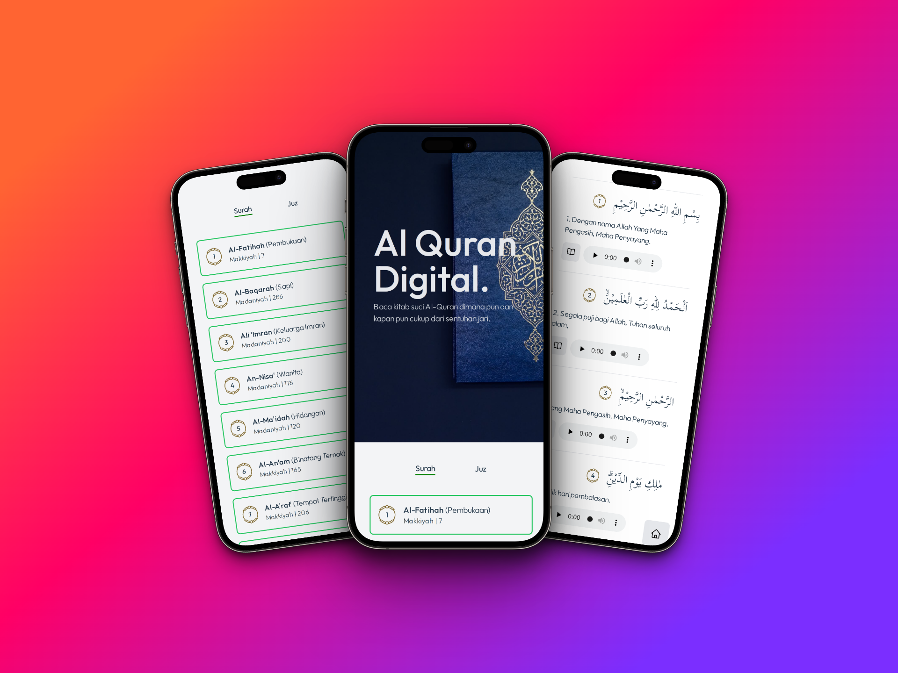

# Quran-React

### Features
- Arabic Ayah
- Surah 1-144
- Juz 1-30
- Indonesian Translation
- Kemenag Tafsir
- Murottal Per Ayah

### Tech Used
- React.js
- Tailwind CSS
- Vite
- Axios

### Credits
- API Used
   - https://quran-api-id.vercel.app/
   - https://quran-6g54mk0s9-gadingnst.vercel.app/
- Images 
   - https://unsplash.com

### Thanks for
- Allah SWT
- Prophet Muhammad
- My Parents
- My Teacher
- @arzakuna7

### Demo : 
https://quransaneba.vercel.app/
